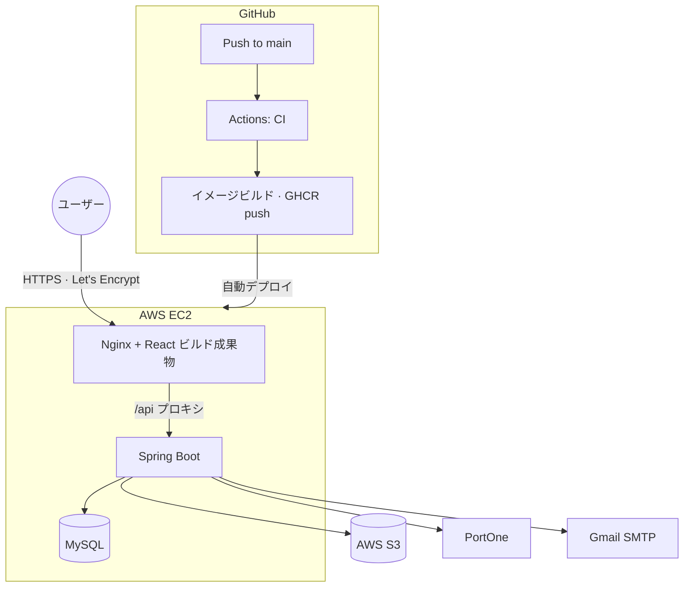

# Prep2gether

      

[한국어](README.md) · **日本語**

> **一人で就活を進めるのは大変だ ― そんな就活生のためのコミュニティプラットフォーム。**
> ばらばらに散らばっていた就活情報・勉強会・専門家相談を、ひとつの流れにつなぎます。

- **公開URL**: https://prep2gether-sunwoo.duckdns.org
- **チーム**: LIKELION バックエンド24期 最終プロジェクト · Team 일석이조（バックエンド4名）
- **開発期間**: 2026.07.29 ~ 08.27（4週間）
- **リポジトリ**: チームリポジトリ（`likelion-backend-24th/ProjectTeam_2`）から分岐し、プロジェクト終了後は個人のインフラへ移して運用しています

## 解決したかった課題

企画会議で最初に出た言葉は **「私たちは、就活生だった」** でした。メンバー4人が当時実際に抱えていた2つの不便から出発しています。

ひとつは **情報と勉強会の分散**。求人はJobKorea、口コミはJobplanet、勉強会の募集はKakaoTalkのオープンチャットや大学コミュニティと、ひとつの準備のために3〜4のサービスを行き来する必要がありました。

もうひとつは **専門家相談のコストと信頼性**。エントリーシートの添削に4万ウォン、模擬面接に5万ウォンが相場となり、実績が検証されていないコンサルタントに数百万ウォンを支払って被害に遭う事例も報じられていました。

そこで、掲示板から勉強会へ、さらに専門家相談へとつながる導線をひとつのサービスに収め、相談だけをサブスクリプション課金として切り出すことで継続可能にすることを目標にしました。

```text
会員登録（メール認証） → ログイン → 掲示板 · 勉強会
                                     └→ サブスク決済（PortOne） → 専門家との1:1相談
```

## チームでの進め方

4人が4週間、同じリポジトリで作り上げた成果物です。「どう分けて、どう合わせたか」は成果物と同じくらい重要だと考えているため、まずその過程を記します。

### ドメインオーナーシップで分担する

機能単位で細かく分けるとコンフリクトが頻発し、設計もぶれます。そこで **ひとつのドメインを一人が最後まで担う** 形にしました。バックエンドからフロント画面まで担当者が通して実装し、設計判断も担当者が下したうえでチームに共有しています。

| 担当 | ドメイン | 主な実装 |
| --- | --- | --- |
| チェ・スンファン | **USER** | 会員登録・メール認証・JWT、ソーシャルログイン（Kakao・Google・Naver）、マイページ、退会、管理者機能 |
| キム・テヨン | **POST** | 掲示板CRUD・検索・ページング、コメント、通報の共通モジュール |
| キム・ジソン | **STUDY** | 勉強会の募集・参加・退会、勉強会専用掲示板、メンバー・管理者権限、画像アップロード（S3）の共通モジュール |
| チョン・ソヌ | **EXPERT** | 専門家登録・審査、1:1相談スレッド、サブスクリプションと定期課金（PortOne） |

### 共通で使うものは一人が作り、4人で使う

4つのドメインすべてに必要な機能は各自で作らず、一人が共通モジュールとして実装し、他のメンバーはそれをそのまま利用しました。画像添付（`FileStorageService` · S3）は掲示板・勉強会・勉強会掲示板・相談で共有し、通報は5種類の対象を単一の `Report` テーブルと単一APIで処理しています。

### 難しい課題は各自で実装し、最終案をまとめる

PortOneの定期課金は、チームの中でもっとも難易度が高く、参考資料によって実装方針が分かれる領域でした。そこで **4人がそれぞれ一度ずつ実装したうえで**、そのうちひとつを最終案に選び、他の実装から良かった部分（Webhook処理など）をマージして完成させました。時間はかかりましたが、メンバー全員が決済フローを理解した状態で締め切りに臨めました。

### あるドメインで得た知見を別のドメインへ渡す

専門家相談のスレッド作成で「確認してから実行する（check-then-act）」だけでは同時リクエストを防げないと分かり、悲観的ロックで解決しました。その後、勉強会の定員チェックで同じ構造の問題が見つかった際には、同じパターンをそのまま適用しています。担当者が違っても、一度経験した問題をチームが二度繰り返さないようにした例です。

機能実装が立て込む中でも、コード規約をそろえ、他ドメインのリポジトリを直接参照していた構造をサービス層経由へリファクタリングするために、別途PRを出しました。

### 数字で見る協働

| 項目 | 数値 |
| --- | --- |
| 人数 / 期間 | 4名 / 4週間 |
| コミット | 約620件 |
| PR | 最終番号 **#158** ― 機能・修正・リファクタ・ドキュメントをすべてPRでマージ |
| ブランチ | `feature/*` · `fix/*` · `refactor/*` · `chore/*` · `docs/*`、mainへの直接プッシュなし |

実装の前に[要件定義書](./docs/requirement.md)と[機能仕様](./docs/design/feature-spec.md)を書き、[権限マトリクス](./docs/design/permission-matrix.md)で「誰が何をできるのか」を表として固めてから着手しました。画面はFigmaで全体を設計したうえで実装しています。

## 主な機能

**会員認証** ― メール認証を経ての登録、Kakao・Google・Naverのソーシャルログイン。同一メールならアカウントを自動統合します。JWT + Refresh Token（HttpOnly Cookie）、ログイン5回失敗でアカウントロック。プロバイダごとに提供される項目が異なるため（Kakaoはニックネームのみ、Googleは実名のみ）、プロバイダ接尾辞でニックネームの衝突を防いでいます。

**掲示板** ― カテゴリ別の投稿、検索、ページング、コメント、画像添付、通報。削除は論理削除で行い、紐づくコメント・画像もあわせて整理します。

**勉強会** ― 作成・検索・参加・退会、メンバー専用掲示板、管理者の委任・強制退会・投稿の固定。非購読者は作成と参加を合わせて2件まで、購読者は無制限です。

**専門家相談** ― 3ステップのウィザードで専門家登録を申請すると、管理者が審査し結果をメールで通知します。購読者は承認済みの専門家に1:1スレッドを作成でき、同一専門家への重複スレッド禁止と同時進行5件の上限が設けられています。

**サブスクリプション（月額9,900ウォン）** ― PortOne V2のビリングキーによる定期課金。カード情報は決済ウィンドウにのみ入力され、サーバーには暗号化されたビリングキーだけが残ります。毎日4時のスケジューラが更新課金を行い、失敗しても即時解約せず猶予状態（`PAST_DUE`）に移して最大3回まで自動リトライします。

**管理者** ― 会員ステータス変更、投稿・勉強会・相談の強制削除、専門家審査、通報対応。

## 技術スタック

| 領域 | 技術 |
| --- | --- |
| Backend | Java 21, Spring Boot 3.5, Spring Data JPA, Spring Security + JWT, OAuth2, springdoc-openapi |
| Frontend | React 19, Vite, Axios |
| Data | MySQL 8.0 |
| 外部連携 | PortOne V2（決済）, AWS S3（画像）, Gmail SMTP（メール） |
| Infra / CI·CD | Docker Compose, Nginx, AWS EC2, GHCR, GitHub Actions, Let's Encrypt |
| Test | JUnit5, H2 |

## アーキテクチャ



`controller → service → repository` で層を分け、リクエスト・レスポンスにはEntityではなくDTOを用い、共通レスポンスは `ApiResponse` 形式に統一しています。

## 技術的な意思決定

判断ごとに **状況 → 決定 → 結果と限界** を残しました。限界を隠さず併記することを原則としています。

**決済の成功可否を、PGのレスポンスではなく再照会で判定しました。** 決済ウィンドウやビリングキー課金の即時レスポンスは改ざんの可能性があり、そのまま信頼できません。レスポンスとは別に決済を再照会し、ステータス・加盟店・チャネル・環境（TEST/LIVE）・金額・通貨の6項目を突き合わせ、ひとつでも食い違えば `FAILED` として記録しサブスクへの反映を拒否します。完了処理は冪等に設計しているため再呼び出しにも安全ですが、返金はAPIではなく解約（次回以降の停止）でのみ対応しています。

**決済失敗は例外ではなくbooleanで扱いました。** カード会社の拒否は「正常に失敗する」ケースであり、例外を投げるとトランザクションがロールバックされ、直前に増やしたリトライ回数まで消えてしまいます。課金結果をbooleanで返し、猶予状態への遷移とリトライ回数を同一トランザクションに残しました。更新スケジューラは1件ごとにトランザクションを分け、ある利用者の失敗が他の利用者の処理を巻き戻さないようにしています。

**退会済みユーザーの有効なJWTは、役割分離で塞ぎました。** 退会しても発行済みトークンは有効期限（1時間）まで有効で、JWTはステートレスなため即時失効できません。「DBに存在しないユーザー」と「存在するが退会状態」を区別し、フィルターは本人確認のみ、利用可否は各サービスの `checkAccountActive()` が担うよう分離しました。構造は明確になりましたが、このチェックを通らないAPIはトークン失効まで完全には防げず、認識したうえでのトレードオフです。

**メール送信をコアトランザクションから切り離しました。** 相談への回答・専門家の承認・サブスク開始のように保存とメールが同時に走る処理では、同期送信だとメールサーバーの遅延がそのままAPIの遅延になり、送信失敗が例外として伝播すると正常に保存されたデータまでロールバックされます。コミット後にのみ送信を呼び出し（`AfterCommitExecutor`）、送信自体は `@Async` で別スレッドに任せ、失敗はログのみ残して伝播させません。代わりに、送信失敗を知らせる手段がないという課題が残っています。

**通報はFKではなくポリモーフィック参照で統合しました。** 通報対象が投稿・コメント・勉強会投稿・勉強会コメント・相談の5種類あり、対象ごとに機能を持つと重複し、ひとつのカラムで5テーブルをFKでつなぐことも不可能です。`target_type` + `target_id` の単一テーブル・単一APIにまとめ、新しい対象はenumの追加だけで拡張できるようにしました。整合性をアプリケーションが担保する代わりに、削除済みの対象は種類別の代替文言で表示します。

## トラブルシューティング

**投稿一覧取得のN+1 ― クエリ21回から2回へ。** 1ページ10件の場合、一覧1回 + 投稿者10回 + 画像10回のクエリが発行されていました。投稿者は `@ManyToOne` のため `JOIN FETCH` とページングを併用しても安全ですが、画像は一対多であり同じ方法では行数が膨らみページングが壊れます。関連の方向によって解法を分け、投稿者は `JOIN FETCH`（+ `countQuery` の分離）、画像はIDリストの `IN` 句によるバッチ取得とグルーピングで処理し、件数に関係なくクエリ2回に固定しました。

**勉強会の定員チェックにおける同時実行制御。** 人数照会 → 定員比較 → 保存の間にロックがなく、残り1枠の勉強会に同時リクエストが来ると全員が通過して定員を超える可能性がありました。対象の `Study` 行に悲観的ロック（`PESSIMISTIC_WRITE`）をかけて参加リクエストを直列化し、同時参加シナリオのテストで定員超過が起きないことを確認しています。

**論理削除が関連データを整理しなかった問題。** `@SoftDelete` はフラグを変えるだけのため、`delete(post)` の1行で済ませていた初期実装ではコメント・画像のレコードが残っていました。DBの `ON DELETE CASCADE` やJPAの `cascade = REMOVE` が介在しない経路であることを確認し、関連データを先に整理してから削除する `deletePostCascade` にロジックを一本化して、投稿者による削除と管理者による削除で共有しました。同じ作業の中で、Hibernate 6.4以降では論理削除エンティティを遅延プロキシとして参照できない制約にも遭遇し、該当箇所を `EAGER` に調整しています。

> デプロイ・インフラ面で遭遇した問題は別途まとめています → **[docs/deployment-troubleshooting.md](./docs/deployment-troubleshooting.md)**（韓国語）

## テスト

```bash
cd backend && ./gradlew test
```

| 検証領域 | 代表的なシナリオ |
| --- | --- |
| 認証・認可 | ログイン失敗によるロック、期限切れ・不一致の認証コード、権限のないリクエスト |
| 掲示板 | 投稿者以外の編集・削除、存在しない投稿 |
| 勉強会 | 参加上限超過、定員超過、委任なしでの管理者退会 |
| 専門家相談 | 非購読者のブロック、重複スレッド、件数超過、終了済みスレッド |
| 通報 | 自分自身・重複通報の防止 |
| 決済・サブスク | 検証失敗、重複購読、リトライとクールダウン、自動更新・失効 |

サービス層の単体テストをH2環境で実行しています。フロントエンドの自動テストは未整備です。

## チームプロジェクトのその後

発表時点の「今後の計画」には **公開ドメインへのHTTPS適用** が残っていました。プロジェクト終了後、このリポジトリを個人のGitHub・AWSアカウントへ移し、その項目を仕上げたうえで運用環境を一から組み直しました。

| 領域 | 実施内容 |
| --- | --- |
| HTTPS | Let's Encryptの証明書をwebroot方式で発行しNginxに適用、80 → 443 リダイレクト |
| ドメイン | Elastic IP + DuckDNSにより、インスタンスを再起動してもアドレスが変わらない構成へ |
| 自動デプロイ | CI通過時にGitHub Actionsがイメージをビルドし、GHCRへpushしてEC2へデプロイ |
| インスタンス | ビルド中にCPUクレジットを使い切りSSHまで届かなくなる障害を経験し、インスタンスタイプを調整 |
| セキュリティ・コスト | mainブランチ保護ルール、AWS Budgetsによる予算アラート、漏洩したSSH鍵のローテーション |
| 外部連携 | Kakao・Google・NaverのOAuthとPortOne決済チャネルを再連携 |

その過程で遭遇した問題は[デプロイ・トラブルシューティング](./docs/deployment-troubleshooting.md)（韓国語）に記録しています。

## セキュリティ点検と対応

個人インフラへ移行した後、運用中のコードを改めて一から見直す機会がありました。その過程で見つけて修正したものです。

**決済なしでサブスクリプションが有効になるAPIが残っていました。** PortOne連携以前、フロントが決済成功を自己判断して呼び出していた `POST /api/subscriptions` が、連携後も削除されずに残っていました。`SecurityConfig` が `anyRequest().authenticated()` だったため、ログインさえしていれば誰でもこのエンドポイントを呼び出し、決済なしでプレミアムになれる構造でした。決済検証を6段階の再照会でどれだけ堅牢にしても、その検証自体を迂回できる経路が残っていれば意味がないと再認識し、コントローラーとサービスから該当メソッドを削除しました。

**Kakao REST APIキーがフロントのバンドルに露出していました。** ブラウザが直接 `kauth.kakao.com` にトークンをリクエストする構造だったため、Viteビルド時にREST APIキーが平文でバンドルに含まれていました。このためクライアントシークレットを有効にするとログイン自体が壊れてしまい、セキュリティ機能を無効にしたまま運用していました。トークン交換をバックエンドへ移し（`POST /api/auth/kakao/callback`）、フロントは認可コードのみをサーバーへ渡す形に変更したうえで、キーとシークレットを再発行しました。

**PortOne Webhookシークレットが実際の値のままCI設定ファイルにコミットされていました。** テスト用のダミー値の中で、この値だけが実際の形式のまま埋め込まれていました。PortOneコンソールでシークレットを再発行して既存の値を無効化し、ワークフローファイルは他の項目と同じダミー値に置き換えました。

3件とも、設計そのものではなく「設計を迂回する経路」から生まれた問題でした。この経験を機に、認可ルールをコードレビューではなくテストで固定する作業を次の課題としました（下記「残っている課題」参照）。

## ローカル実行

JDK 21、Node.js 20+、Dockerが必要です。

```bash
git clone https://github.com/DANIELSUNWOO/prep2gether.git
cd prep2gether
# backend/.env, frontend/.env を作成（frontend/.env.example 参照）
docker compose up -d --build
```

- フロントエンド http://localhost · バックエンド http://localhost:8080 · Swagger `/swagger-ui/index.html`
- DB・JWT・S3・Mail・PortOne関連のSecretは各自で取得して設定し、コミットしません。

## ドキュメント

| ドキュメント | 場所 |
| --- | --- |
| 要件定義書 | [docs/requirement.md](./docs/requirement.md) |
| 機能仕様 · API仕様 | [docs/design/feature-spec.md](./docs/design/feature-spec.md) · [api-spec.md](./docs/design/api-spec.md) |
| ERD · DDL | [docs/design/erd.md](./docs/design/erd.md) · [docs/sql/00_ddl.sql](./docs/sql/00_ddl.sql) |
| 権限マトリクス | [docs/design/permission-matrix.md](./docs/design/permission-matrix.md) |
| ユーザーフロー · シーケンス · 画面設計 | [docs/design](./docs/design) |
| デプロイ・トラブルシューティング | [docs/deployment-troubleshooting.md](./docs/deployment-troubleshooting.md) |

※ ドキュメント類は韓国語で記述されています。

## 残っている課題

証明書の自動更新（cron）はまだ設定しておらず、自動デプロイがSSHベースのため22番ポートが開いたままです。AWS SSMへ移行すればポートを閉じられます。非同期メール送信の失敗を検知する手段がない点もそのまま残っています。

機能面では、投稿編集時の画像差し替え、勉強会の承認制、決済Webhookの署名検証の強化と失敗通知、そしてKakaoログイン利用者にはメール通知が届かない問題を解決するためのKakaoTalk通知連携が残っています。

認可ルール（`SecurityConfig`、`JwtAuthenticationFilter`）を検証するテストがまだなく、上記で修正したものと同種の問題が再発してもCIでは検知できません。`@WebMvcTest` ベースの認可テストの追加が次の優先事項です。
