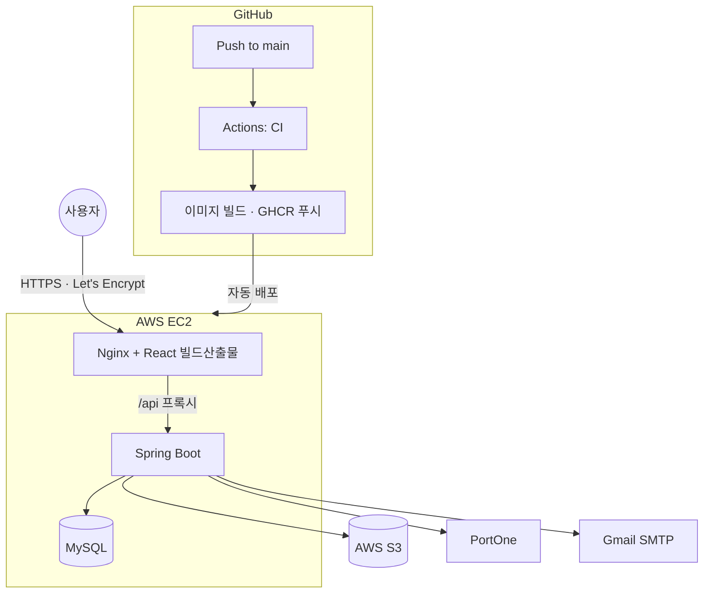

# Prep2gether

      

**한국어** · [日本語](README.ja.md)

> **혼자 준비하기 벅찬 취준생을 위한 커뮤니티 플랫폼.**
> 흩어져 있던 취업 정보·스터디·전문가 상담을 하나의 흐름으로 잇습니다.

- **배포 주소**: https://prep2gether-sunwoo.duckdns.org
- **팀**: 멋쟁이사자처럼 백엔드 24기 파이널 프로젝트 · Team 일석이조 (백엔드 4인)
- **기간**: 2026.07.29 ~ 08.27 (4주)
- **저장소**: 팀 저장소(`likelion-backend-24th/ProjectTeam_2`)에서 갈라져 나와, 종료 후 개인 인프라로 이관해 운영 중입니다

## 이 프로젝트가 풀려던 문제

기획 회의에서 나온 첫 문장은 **"우리는, 취준생이었다"** 였습니다. 팀원 넷이 그때 실제로 겪고 있던 두 가지 불편에서 출발했습니다.

하나는 **정보와 스터디의 파편화**. 공고는 잡코리아, 후기는 잡플래닛, 스터디 모집은 카톡 오픈채팅방과 에브리타임에 흩어져 있어 하나를 준비하는 데 서너 개 플랫폼을 오가야 했습니다.

다른 하나는 **전문가 상담의 비용과 신뢰**. 자소서 첨삭 4만 원, 모의면접 5만 원이 시세가 되었고, 검증되지 않은 컨설턴트에게 수백만 원을 쓰고 피해를 보는 사례도 나오고 있었습니다.

그래서 게시판에서 시작해 스터디로, 다시 전문가 상담으로 이어지는 흐름을 한 서비스 안에 넣고, 상담만 구독 결제로 분리해 지속 가능하게 만드는 것을 목표로 잡았습니다.

```text
회원가입(이메일 인증) → 로그인 → 게시판 · 스터디 활동
                                   └→ 구독 결제(PortOne) → 전문가 1:1 상담
```

## 팀으로 일한 방식

네 명이 4주 동안 같은 저장소에서 만든 결과물입니다. 어떻게 나누고 어떻게 합쳤는지가 결과물만큼 중요하다고 생각해, 그 과정을 먼저 적습니다.

### 도메인 오너십으로 나누기

기능 단위로 잘게 쪼개 나누면 매번 충돌이 나고 설계가 흔들립니다. 그래서 **도메인 하나를 한 사람이 끝까지 책임지는 방식**으로 나눴습니다. 백엔드부터 프론트 화면까지 담당자가 이어서 작업했고, 설계 판단도 담당자가 내린 뒤 팀에 공유했습니다.

| 담당 | 도메인 | 주요 구현 |
| --- | --- | --- |
| 최승환 | **USER** | 회원가입·이메일 인증·JWT, 소셜 로그인(카카오·구글·네이버), 마이페이지, 탈퇴, 어드민 |
| 김태영 | **POST** | 게시판 CRUD·검색·페이징, 댓글, 신고 공통 모듈 |
| 김지선 | **STUDY** | 스터디 모집·가입·탈퇴, 스터디 게시판, 멤버·방장 관리, 이미지(S3) 공통 모듈 |
| 정선우 | **EXPERT** | 전문가 등록·심사, 1:1 상담 스레드, 유료 구독·정기결제(PortOne) |

### 공통으로 쓸 것은 한 사람이 만들고 넷이 가져다 쓴다

네 도메인에 모두 필요한 기능은 각자 만들지 않고 한 명이 공통 모듈로 구현한 뒤 나머지가 그대로 썼습니다. 이미지 첨부(`FileStorageService` · S3)는 게시판·스터디·스터디 게시판·상담이 함께 쓰고, 신고는 대상 5종을 단일 `Report` 테이블과 단일 API로 처리합니다.

### 어려운 문제는 각자 구현해보고 최종안을 합친다

PortOne 정기결제는 팀에서 가장 난이도가 높고 레퍼런스가 갈리는 영역이었습니다. 그래서 넷이 **각자 한 번씩 구현해본 뒤**, 그중 하나를 최종안으로 고르고 다른 구현에서 좋았던 부분(웹훅 처리 등)을 병합해 완성했습니다. 시간은 더 들었지만 팀 전원이 결제 흐름을 이해한 채로 마감에 들어갈 수 있었습니다.

### 한 도메인에서 배운 것을 다른 도메인으로 옮긴다

전문가 상담 스레드 개설에서 "조회 후 판단(check-then-act)"만으로는 동시 요청을 막을 수 없다는 걸 겪고 비관적 락으로 해결했는데, 이후 스터디 가입 정원 체크에서 같은 구조의 문제가 발견되자 같은 패턴을 그대로 적용했습니다. 담당자가 달라도 한 번 겪은 문제를 팀이 두 번 겪지 않도록 공유한 사례입니다.

기능이 급한 와중에도 코드 컨벤션을 맞추고, 다른 도메인의 리포지토리를 직접 참조하던 구조를 서비스 계층 경유로 리팩토링하는 데 별도 PR을 냈습니다.

### 숫자로 본 협업

| 항목 | 수치 |
| --- | --- |
| 인원 / 기간 | 4명 / 4주 |
| 커밋 | 약 620건 |
| PR | 최종 번호 **#158** — 기능·수정·리팩토링·문서를 모두 PR로 병합 |
| 브랜치 | `feature/*` · `fix/*` · `refactor/*` · `chore/*` · `docs/*`, main 직접 푸시 없음 |

기능을 만들기 전에 [요구사항 정의서](./docs/requirement.md)와 [기능 명세](./docs/design/feature-spec.md)를 쓰고, [권한 매트릭스](./docs/design/permission-matrix.md)로 "누가 무엇을 할 수 있는가"를 표로 고정한 뒤 구현에 들어갔습니다. 화면은 Figma로 전체를 설계한 다음 붙였습니다.

## 핵심 기능

**회원 인증** — 이메일 인증 후 가입, 카카오·구글·네이버 소셜 로그인. 동일 이메일이면 계정을 자동 통합합니다. JWT + Refresh Token(HttpOnly 쿠키), 로그인 5회 실패 시 잠금. 제공자마다 주는 필드가 달라(카카오는 닉네임만, 구글은 실명만) 제공자 접미사로 닉네임 충돌을 막습니다.

**게시판** — 카테고리별 작성, 검색, 페이징, 댓글, 이미지 첨부, 신고. 삭제는 소프트 삭제로 처리하며 연관 댓글·이미지를 함께 정리합니다.

**스터디** — 개설·검색·가입·탈퇴, 멤버 전용 게시판, 방장 위임·강퇴·게시글 고정. 미구독자는 개설과 참여를 합쳐 2개까지, 구독자는 무제한입니다.

**전문가 상담** — 3단계 위저드로 전문가 등록을 신청하면 관리자가 심사하고 결과를 메일로 보냅니다. 구독자는 승인된 전문가에게 1:1 스레드를 열 수 있으며, 동일 전문가 중복 스레드 금지와 동시 진행 5개 제한이 걸립니다.

**유료 구독 (월 9,900원)** — PortOne V2 빌링키 정기결제. 카드 정보는 결제창에만 입력되고 서버에는 암호화된 빌링키만 남습니다. 매일 04시 스케줄러가 갱신을 청구하고, 실패하면 바로 해지하지 않고 유예 상태(`PAST_DUE`)로 두어 최대 3회 자동 재시도합니다.

**관리자** — 회원 상태 변경, 게시글·스터디·상담 강제 삭제, 전문가 심사, 신고 처리.

## 기술 스택

| 영역 | 기술 |
| --- | --- |
| Backend | Java 21, Spring Boot 3.5, Spring Data JPA, Spring Security + JWT, OAuth2, springdoc-openapi |
| Frontend | React 19, Vite, Axios |
| Data | MySQL 8.0 |
| 외부 연동 | PortOne V2(결제), AWS S3(이미지), Gmail SMTP(메일) |
| Infra / CI·CD | Docker Compose, Nginx, AWS EC2, GHCR, GitHub Actions, Let's Encrypt |
| Test | JUnit5, H2 |

## 아키텍처



`controller → service → repository`로 계층을 나누고, 요청·응답에는 Entity 대신 DTO를 쓰며, 공통 응답은 `ApiResponse` 포맷으로 통일했습니다. 도메인별 패키지 구조는 [프로젝트 구조 문서](./docs/design/convention.md)를 참고해 주세요.

## 기술적 의사결정

결정마다 **상황 → 결정 → 결과와 한계**를 남겼습니다. 한계를 숨기지 않고 함께 적는 것을 원칙으로 했습니다.

**결제 성공을 PG 응답이 아닌 재조회로 판정했습니다.** 결제창·빌링키 청구의 즉시 응답은 위·변조 가능성이 있어 그대로 신뢰하기 어렵습니다. 응답과 별개로 결제를 다시 조회해 상태·상점·채널·환경(TEST/LIVE)·금액·통화 여섯 가지를 대조하고, 하나라도 어긋나면 `FAILED`로 기록한 뒤 구독 반영을 거부합니다. 완료 처리는 멱등하게 설계해 재호출에도 안전하지만, 환불은 API 대신 해지(다음 회차 중단)로만 처리합니다.

**결제 실패는 예외가 아니라 boolean으로 다뤘습니다.** 카드사 거절은 "정상적으로 실패"하는 경우인데, 예외를 던지면 트랜잭션이 롤백되면서 방금 올린 실패 횟수까지 사라집니다. 청구 결과를 boolean으로 반환해 유예 상태 전환과 재시도 횟수를 같은 트랜잭션에 남기고, 갱신 스케줄러는 건별 트랜잭션으로 돌려 한 사람의 실패가 다른 사람 처리를 되돌리지 않게 했습니다.

**탈퇴한 유저의 살아있는 JWT는 역할 분리로 막았습니다.** 탈퇴해도 이미 발급된 토큰은 만료(1시간)까지 유효하고 JWT는 stateless라 즉시 무효화할 수 없습니다. "DB에 없는 유저"와 "있지만 탈퇴 상태"를 구분해, 필터는 신원 확인만 하고 이용 가능 여부는 각 서비스의 `checkAccountActive()`가 책임지게 했습니다. 구조는 명확해졌지만 이 체크를 거치지 않는 API는 토큰 만료 전까지 완전히 막히지 않으며, 인지하고 선택한 트레이드오프입니다.

**메일 발송을 핵심 트랜잭션에서 떼어냈습니다.** 상담 답변·전문가 승인·구독 시작처럼 저장과 메일이 함께 도는 로직에서 동기 발송은 메일 서버 지연이 곧 API 지연이 되고, 발송 실패가 예외로 퍼지면 정상 저장된 데이터까지 롤백됩니다. 커밋 이후에만 발송을 호출하고(`AfterCommitExecutor`), 전송은 `@Async`로 별도 스레드에서 처리하며, 실패는 로그만 남기고 전파하지 않습니다. 대신 발송 실패를 알릴 수단이 없다는 문제가 남아 있습니다.

**신고는 FK 대신 다형 참조로 통합했습니다.** 신고 대상이 게시글·댓글·스터디 게시글·스터디 댓글·상담 다섯 종인데, 대상마다 기능을 두면 중복이고 한 컬럼으로 다섯 테이블을 FK로 잇는 것도 불가능합니다. `target_type` + `target_id`의 단일 테이블·단일 API로 묶어 새 대상은 enum 추가만으로 확장되게 했습니다. 참조 무결성을 앱이 책임지는 대신, 삭제된 대상은 타입별 방어 문구로 대체합니다.

## 트러블슈팅

**게시글 목록 조회의 N+1 — 쿼리 21회에서 2회로.** 한 페이지 10건이면 목록 1 + 작성자 10 + 이미지 10번의 쿼리가 나갔습니다. 작성자는 `@ManyToOne`이라 `JOIN FETCH`와 페이징을 함께 써도 안전하지만, 이미지는 일대다라 같은 방법을 쓰면 row가 뻥튀기되어 페이지가 깨집니다. 연관관계 방향에 따라 해법을 나눠, 작성자는 `JOIN FETCH`(+`countQuery` 분리)로, 이미지는 ID 목록 `IN`절 배치 조회 후 그룹핑으로 처리해 글 수와 무관하게 쿼리 2회로 고정했습니다.

**스터디 가입 정원 체크의 동시성.** 인원 조회 → 정원 비교 → 저장 사이에 락이 없어, 한 자리 남은 스터디에 동시 요청이 오면 모두 통과해 정원을 넘길 수 있었습니다. 대상 `Study` 행에 비관적 락(`PESSIMISTIC_WRITE`)을 걸어 가입 요청을 직렬화하고, 동시 가입 시나리오 테스트로 정원 초과가 없음을 확인했습니다.

**소프트삭제가 연관 데이터를 정리하지 않던 문제.** `@SoftDelete`는 플래그만 바꿀 뿐이라 `delete(post)` 한 줄로 처리하던 초기 구현에서는 댓글·이미지 레코드가 그대로 남았습니다. DB의 `ON DELETE CASCADE`나 JPA `cascade = REMOVE`가 개입하지 않는 경로임을 확인하고, 연관 데이터를 먼저 정리한 뒤 삭제하는 `deletePostCascade`로 로직을 단일화해 작성자 삭제와 관리자 삭제가 함께 쓰도록 했습니다. 같은 작업 중 Hibernate 6.4+가 소프트삭제 엔티티를 지연 프록시로 참조하지 못한다는 제약도 만나, 해당 참조를 `EAGER`로 조정했습니다.

> 배포·인프라에서 겪은 문제는 따로 정리했습니다 → **[docs/deployment-troubleshooting.md](./docs/deployment-troubleshooting.md)**

## 테스트

```bash
cd backend && ./gradlew test
```

| 검증 영역 | 대표 시나리오 |
| --- | --- |
| 인증·인가 | 로그인 실패 잠금, 만료·불일치 인증코드, 권한 없는 요청 |
| 게시판 | 작성자 외 수정·삭제, 없는 게시글 |
| 스터디 | 가입 한도 초과, 정원 초과, 미위임 방장 탈퇴 |
| 전문가 상담 | 비구독자 차단, 중복 스레드, 개수 초과, 종료된 스레드 |
| 신고 | 본인·중복 신고 방지 |
| 결제·구독 | 검증 실패, 중복 구독, 재시도·쿨다운, 자동 갱신·만료 |

서비스 계층 단위 테스트를 H2 환경에서 수행합니다. 프론트엔드 자동화 테스트는 아직 없습니다.

## 팀 프로젝트 이후

발표 당시 "향후 계획"에 **배포 도메인 HTTPS 적용**이 남아 있었습니다. 프로젝트가 끝난 뒤 이 저장소를 개인 GitHub·AWS 계정으로 옮겨 그 항목을 마무리하고, 운영 환경을 처음부터 다시 세웠습니다.

| 영역 | 한 일 |
| --- | --- |
| HTTPS | Let's Encrypt 인증서를 webroot 방식으로 발급해 Nginx에 적용, 80 → 443 리다이렉트 |
| 도메인 | Elastic IP + DuckDNS로 인스턴스를 재시작해도 주소가 바뀌지 않게 구성 |
| 자동 배포 | CI 통과 시 GitHub Actions가 이미지를 빌드해 GHCR에 올리고 EC2에 배포 |
| 인스턴스 | 빌드 중 CPU 크레딧이 고갈돼 SSH까지 막히는 장애를 겪고 인스턴스 유형을 조정 |
| 보안·비용 | main 브랜치 보호 규칙, AWS 예산 알림, 노출된 SSH 키 교체 |
| 외부 연동 | 카카오·구글·네이버 OAuth와 PortOne 결제 채널 재연동 |

그 과정에서 겪은 문제들은 [배포 트러블슈팅 문서](./docs/deployment-troubleshooting.md)에 남겼습니다.

## 실행 방법

JDK 21, Node.js 20+, Docker가 필요합니다.

```bash
git clone https://github.com/DANIELSUNWOO/prep2gether.git
cd prep2gether
# backend/.env, frontend/.env 작성 (frontend/.env.example 참고)
docker compose up -d --build
```

- 프론트엔드 http://localhost · 백엔드 http://localhost:8080 · Swagger `/swagger-ui/index.html`
- DB·JWT·S3·Mail·PortOne 관련 Secret은 각자 발급받아 채우고 커밋하지 않습니다.

## 문서

| 문서 | 위치 |
| --- | --- |
| 요구사항 정의서 | [docs/requirement.md](./docs/requirement.md) |
| 기능 명세 · API 명세 | [docs/design/feature-spec.md](./docs/design/feature-spec.md) · [api-spec.md](./docs/design/api-spec.md) |
| ERD · DDL | [docs/design/erd.md](./docs/design/erd.md) · [docs/sql/00_ddl.sql](./docs/sql/00_ddl.sql) |
| 권한 매트릭스 | [docs/design/permission-matrix.md](./docs/design/permission-matrix.md) |
| 유저 플로우 · 시퀀스 · 화면설계 | [docs/design](./docs/design) |
| 배포 트러블슈팅 | [docs/deployment-troubleshooting.md](./docs/deployment-troubleshooting.md) |

## 남은 과제

인증서 자동 갱신(cron)은 아직 걸려 있지 않고, 자동 배포가 SSH 기반이라 22번 포트가 열려 있습니다. AWS SSM으로 옮기면 포트를 닫을 수 있습니다. 비동기 메일 발송 실패를 알릴 수단이 없는 것도 그대로 남아 있습니다.

기능 쪽으로는 게시글 수정 시 이미지 교체, 스터디 승인제, 결제 웹훅 서명 검증 강화와 실패 알림, 그리고 카카오 로그인 사용자에게 메일 알림이 닿지 않는 문제를 풀기 위한 카카오톡 알림 연동이 남아 있습니다.
